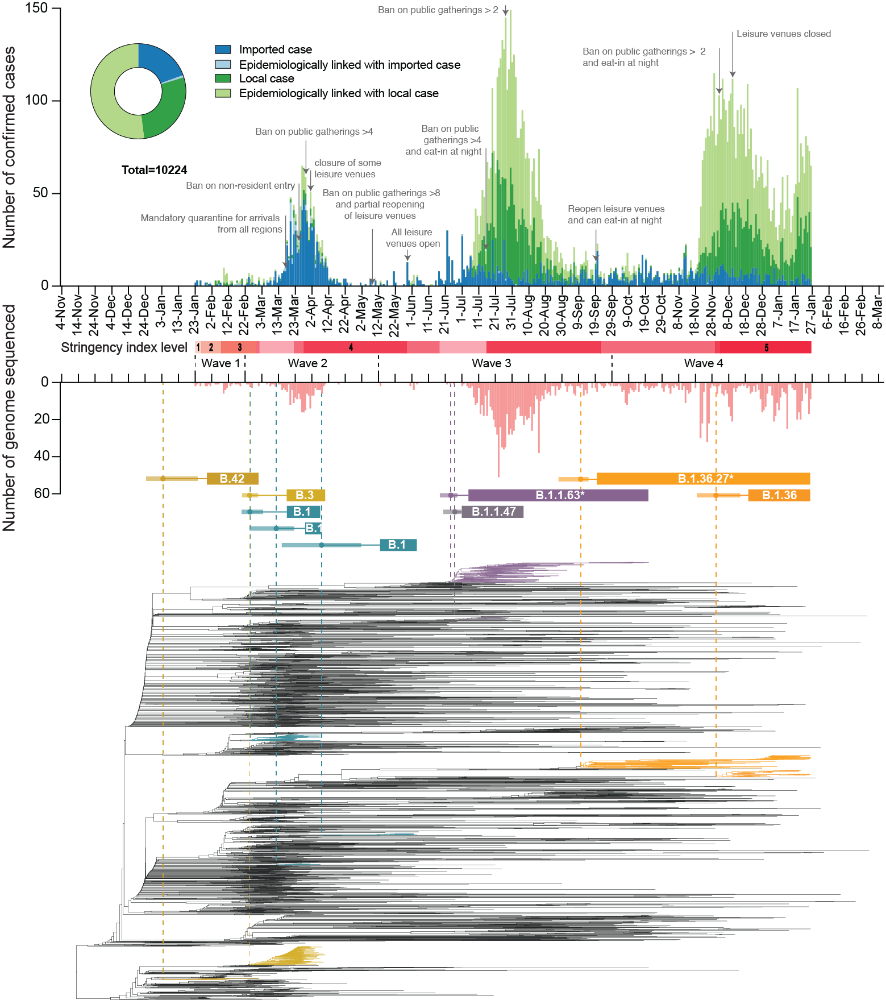

# SARS-CoV-2 Under an Elimination Strategy in Hong Kong


Haogao Gu, Ruopeng Xie, Dillon C. Adam, Joseph L.-H. Tsui, Daniel K. Chu, Lydia D.J Chang, Sammi S.Y. Cheuk, Shreya Gurung, Pavithra Krishnan, Daisy Y.M. Ng, Gigi Y.Z. Liu, Carrie K.C. Wan, Kimberly M. Edwards, Kathy S.M. Leung, Joseph T.K. Wu, Dominic N.C. Tsang, Gabriel M. Leung, Benjamin J. Cowling, Malik J. S. Peiris, Tommy T.Y. Lam, Vijaykrishna Dhanasekaran, Leo L.M. Poon

---
[Preprint](https://www.medrxiv.org/content/10.1101/2021.06.19.21259169v1)

This repository contains data and codes for reproducing the analysis presented in *SARS-CoV-2 Under an Elimination Strategy in Hong Kong*.

The genomic sequences were not included in this repository according to GISAID [terms of use](https://www.gisaid.org/registration/terms-of-use/), instead, the GISIAD accession IDs of all consensus sequences used in this study were listed [here](./data/GISAID_accession_ID.csv). The primary epidemiological data of confirmed cases in Hong Kong are freely available via the [official webpage](https://data.gov.hk/en-data/dataset/hk-dh-chpsebcddr-novel-infectious-agent).

## The structure of this repository
The source codes for different analyses were stored in different sub-directories under the *scripts* directory. Related data which can be shared are stored under the *data* directory. The results generated by the scripts can be found in the *results* directory. 

```
HK-SARS-CoV-2-sequencing-analysis/
├── data
│   ├── Phylodynamics
│   ├── BDSS
│   ├── Bottleneck_and_SNVs
│   ├── misc
│   └── README.md
├── scripts
│   ├── Phylodynamics
│   ├── BDSS
│   ├── Bottleneck_and_SNVs
│   ├── misc
│   └── README.md
├── results
│   ├── Phylodynamics
│   ├── BDSS
│   ├── Bottleneck_and_SNVs
│   └── README.md
└── README.md
```

## Abstract
Hong Kong utilized an elimination strategy with intermittent use of public health and social measures and increasingly stringent travel regulations to control SARS-CoV-2 transmission. By analyzing >1700 genome sequences representing 17% of confirmed cases from 23-January-2020 to 26-January-2021, we reveal the effects of fluctuating control measures on the evolution and epidemiology of SARS-CoV-2 lineages in Hong Kong. Despite numerous importations, only three introductions were responsible for 90% of locally-acquired cases, two of which circulated cryptically for weeks while less stringent measures were in place. We found that SARS-CoV-2 within-host diversity was most similar among transmission pairs and epidemiological clusters due to a strong transmission bottleneck through which similar genetic background generates similar within-host diversity.




---
